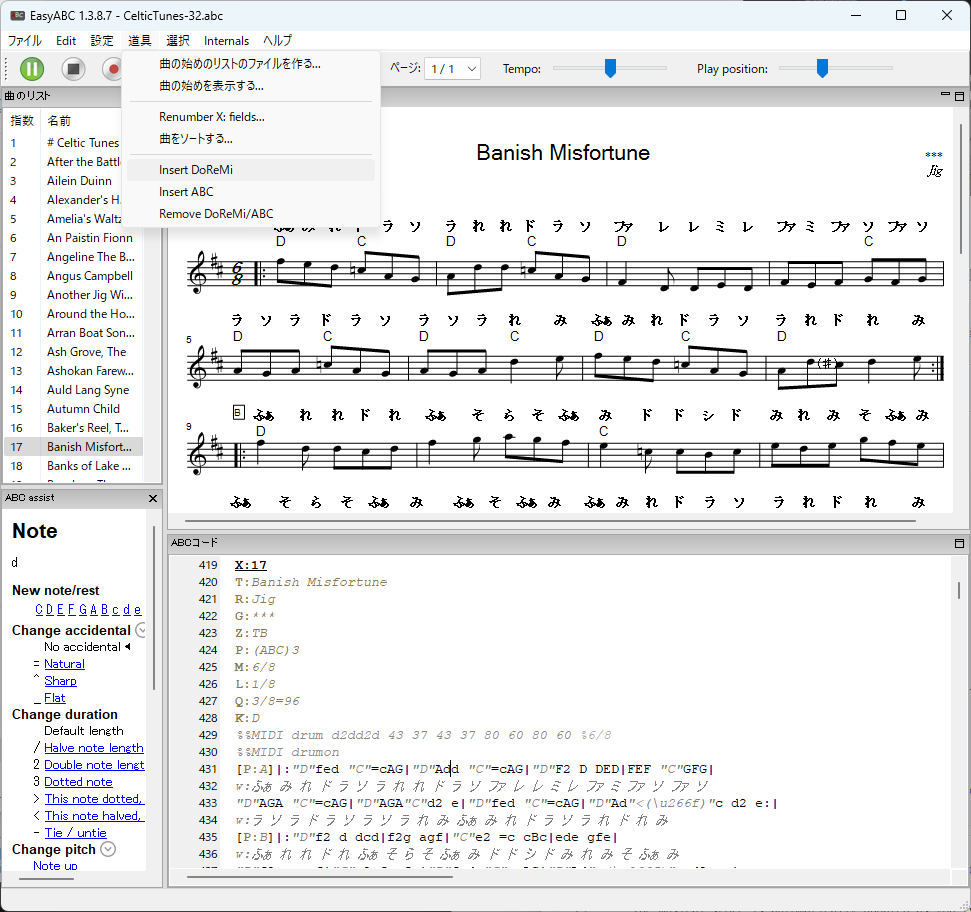

[https://github.com/kazgoshi/EasyABCwDoReMi](https://github.com/kazgoshi/EasyABCwDoReMi)

[EasyABC](EasyABC https://github.com/jwdj/EasyABC)の歌詞のところ(w: 属性)にドレミを記入する機能を追加

Tool(道具)のInsert DoReMiでドレミを追加




[Windows11 Installer　EasyABC-1.3.8.7-wDoReMi-2024-0317-v1.0.0.exe](https://github.com/kazgoshi/EasyABCwDoReMi/releases/download/v1.0.0/EasyABC-1.3.8.7-wDoReMi-2024-0317-v1.0.0.exe)

ソースからの実行方法
```
python-3.9.13-amd64.exe をインストール

仮想環境作成
py -3.9 -m venv easyabc

切替
easyabc\scripts\activate

cd EasyABCwDoReMi

py -3.9 -m pip list
py -3.9 -m pip install -U wxPython
py -3.9 -m pip install pywin32
py -3.9 -m pip install pygame
py -3.9 -m pip install pyparsing
py -3.9 -m pip install cx-Freeze

実行
py -3.9 easy_abc.py

binにabcmidi, nwc2xml, zlib, FluidSynthをコピー
 abcmidi_win32_mingw64.zip の *.exe を binにコピー
 nwc2xml-win-1.5.0.5.zip の nwc2xml.exe を binにコピー
 zlib123dllx64.zip の dll_x64の中の zlibwapi.dll を binにコピー
 binの中にFluidSynthのフォルダーを作る
 fluidsynth-2.3.4-win10-x64.zip のbinの中の*.dll を binの中のFluidSynthにコピー

build
outputフォルダにインストーラができる
```


## Links(ソースからの実行に必要なもの)
- [abcmidi_win32_mingw64.zip https://ifdo.ca/~seymour/runabc/abcmidi_win32_mingw64.zip](https://ifdo.ca/~seymour/runabc/abcmidi_win32_mingw64.zip)

- [nwc2xml-win-1.5.0.5.zip https://storage.googleapis.com/google-code-archive-downloads/v2/code.google.com/nwc2xml/nwc2xml-win-1.5.0.5.zip](https://storage.googleapis.com/google-code-archive-downloads/v2/code.google.com/nwc2xml/nwc2xml-win-1.5.0.5.zip)

- [zlib123dllx64.zip http://www.winimage.com/zLibDll/zlib123dll.zip](http://www.winimage.com/zLibDll/zlib123dll.zip)

- [fluidsynth-2.3.4-win10-x64.zip https://github.com/FluidSynth/fluidsynth/releases/download/v2.3.4/fluidsynth-2.3.4-win10-x64.zip](https://github.com/FluidSynth/fluidsynth/releases/download/v2.3.4/fluidsynth-2.3.4-win10-x64.zip)

## Links
- [EasyABC https://github.com/jwdj/EasyABC ](https://github.com/jwdj/EasyABC)

- [EasyABC https://sourceforge.net/projects/easyabc/](https://sourceforge.net/projects/easyabc/)

- [abcmidi https://github.com/sshlien/abcmidi](https://github.com/sshlien/abcmidi)

- [abcmidi https://ifdo.ca/~seymour/runabc/top.html](https://ifdo.ca/~seymour/runabc/top.html)

- [nwc2xml https://github.com/mzealey/nwc2xml](https://github.com/mzealey/nwc2xml)

- [zlib https://www.winimage.com/zLibDll/](https://www.winimage.com/zLibDll/)

- [FluidSynth https://github.com/FluidSynth/fluidsynth](https://github.com/FluidSynth/fluidsynth)

- [ABCファイル https://hallflutes.com/play-along-celtic-tunes/から](https://hallflutes.com/CelticTunes-35.abc)  
